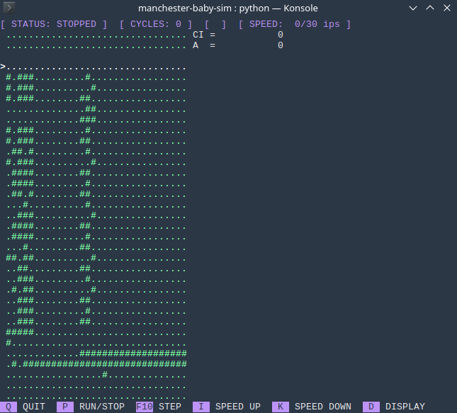

# Small-Scale Experimental Machine (SSEM) simulator

The SSEM, also known as the Manchester Baby was the first electronic stored-program computer.

As it is very simple, it is a good subject to study the basic principles of computing.

This program aims at simulating accurately the SSEM while allowing to play with it and tweak it.



# Test it

```sh
python main.py samples/ssem/fibonacci.asm
```
The result will appear on the 28th line in binary.

# Roadmap

- [x] Assembler language linting
- [x] Assembler to binary
- [x] Run the program
- [x] Make the assembler generic by extracting the language definition
- [x] Read binary representation files (.snp)
- [x] Improve readability (display option)
- [x] Interactive interface
  - [x] Use curses
  - [x] User input
  - [x] Display modes
  - [x] Scroll in store with arrows when terminal is too small
  - [x] Fix visual bugs
- [ ] Improve interactive interface
  - [ ] Handle screen resize
  - [ ] Accurate speed execution
  - [ ] Help window
- [ ] Unit and functional tests (partially done)
- [ ] Implement breakpoints: automatically stop at a given condition
- [ ] Implement other machines with this engine
- [ ] Save user preferences

# Documentation

[Documentation](docs/README.md)

# Bibliography

David Tarnoff, "Programming the 1948 Manchester Baby (SSEM)" https://www.youtube.com/watch?v=o7ozlF5ujUw

Chris P Burton, "The Manchester University Small-Scale Experimental Machine Programmer's Reference Manual" http://curation.cs.manchester.ac.uk/computer50/www.computer50.org/mark1/prog98/ssemref.html

Computer Conservation Society, "SSEM - Technical Overview" https://computerconservationsociety.org/ssemvolunteers/volunteers/introframe.html

David Sharp, "Manchester Baby Simulator" https://davidsharp.com/baby/

Brian Napper, "The Manchester Small Scale Experimental Machine -- "The Baby""
https://web.archive.org/web/20081013180637/http://www.computer50.org/mark1/new.baby.html#specification

# License

This program is licensed under the MIT license.
